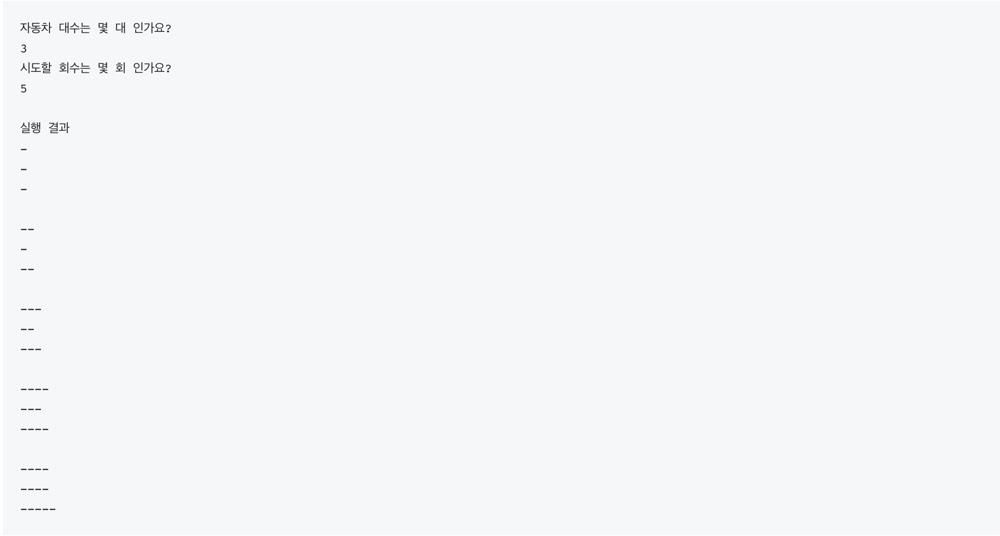

자동차 경주 게임 with TDD
==
###### written by 자바카페 금성현
<!-- footer:Object Calisthenics. -->

---

요구사항 1
==
- 기능 요구사항
	- 초간단 자동차 경주 게임을 구현한다.
	- 주어진 횟수 동안 n대의 자동차는 전진 또는 멈출 수 있다.
	- 사용자는 몇 대의 자동차로 몇 번의 이동을 할 것인지를 입력할 수 있어야 한다.
	- 전진하는 조건은 0에서 9 사이에서 random 값을 구한 후 random 값이 4이상일 경우이다.
	- 자동차의 상태를 화면에 출력한다. 어느 시점에 출력할 것인지에 대한 제약은 없다.

---

요구사항 2
==
- 프로그래밍 요구사항
	- 메소드가 너무 많은 일을 하지 않도록 분리하기 위해 노력해 본다.
	- 규칙 2: else 예약어를 쓰지 않는다.
	- 모든 로직에 단위 테스트를 구현한다. 단, UI(System.out, System.in) 로직은 제외
	- naming convention을 지키면서 프로그래밍한다.
	
---

Naming Convention
==

자바는 낙타 표기법(Camel Case)를 따른다.
클래스명은 대문자로 시작, 변수 메소드는 소문자로 시작
클래스 이름 예 : Rectangle, LaundryList, StudentDirectory
변수 이름 예 : firstName, description, mediaController
메소드 이름 예 : getFirstName(), cancelOrder(), isDeleted()

---

---

The Rules
Here are the rules for the exercise:
==
1. Use only one level of indentation per method.
2. Don’t use the else keyword.
3. Wrap all primitives and strings.
4. Use only one dot per line.
5. Don’t abbreviate.
6. Keep all entities small.
7. Don’t use any classes with more than two instance variables.
8. Use first-class collections.
9. Don’t use any getters/setters/properties.
